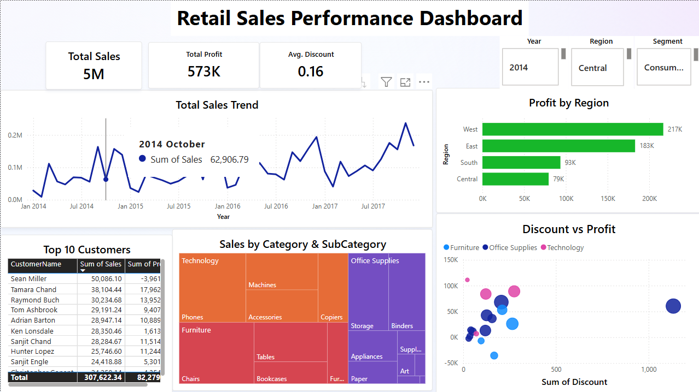

# 📊 Retail Sales Performance Dashboard (Power BI + SQL Server)

This project simulates a real-world Business Intelligence system for a retail company using Power BI and SQL Server. I designed an end-to-end solution to extract, store, and visualize sales data from a mock dataset (Superstore).

## 🚀 Features

- 🗂 Data storage in SQL Server (local)
- ⚙️ Data ingestion using Python (pandas + pyodbc)
- 📈 Power BI Dashboard with 5+ visuals and smart filters
- 📍 Region-wise profitability, discount-profit analysis, and customer insights
- 🔍 Interactive slicers: Region, Segment, Year
- 🧠 KPI Cards: Total Sales, Profit, and Avg. Discount
- 📝 Exported PDF for stakeholders and static reporting

## 📁 Tech Stack

- Microsoft SQL Server Express (data warehouse)
- Python (pandas, pyodbc)
- Power BI (visualization and report building)
- SSMS (database interface)

## 📸 Dashboard Preview

## 📄 Dataset

- [Superstore Dataset (Kaggle)](https://www.kaggle.com/datasets/vivek468/superstore-dataset-final)

## 📌 How to Run

1. Set up SQL Server and create the `RetailBI` database
2. Run `load_orders.py` to populate the `Orders` table
3. Open `Retail_Sales_Insights.pbix` in Power BI and connect to your local SQL Server
4. Use slicers and visuals to explore business insights

## 📌 Business Use Case

This dashboard provides actionable insights for decision-makers to:
- Identify high- and low-performing regions and products
- Evaluate customer value and profitability
- Detect negative profit trends caused by high discounts
